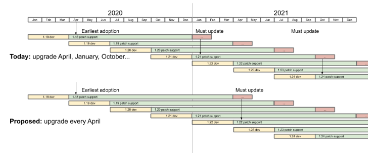

从一个有趣的问题引出很多人都在关注的 Kubernetes LTS 的问题。

# 有趣的问题

2019 年，一个名为 [apiserver LoopbackClient Server cert expired after 1 year](https://github.com/kubernetes/kubernetes/issues/86552) 的 issue 中提到了一个有趣的问题，**如果一个 kube-apiserver 已经一年没有重启过了，那么这个 kube-apiserver 就无法再正常工作了**。

issue 作者给出了自己的定位的原因：**kube-apiserver 没有更新自签的 LoopbackClient 证书相关内容**。从下面代码中可以看到证书过期时间被设置为了 1 年。

```go
	// create self-signed cert+key with the fake server.LoopbackClientServerNameOverride and
	// let the server return it when the loopback client connects.
	certPem, keyPem, err := certutil.GenerateSelfSignedCertKey(server.LoopbackClientServerNameOverride, nil, nil)
	if err != nil {
		return fmt.Errorf("failed to generate self-signed certificate for loopback connection: %v", err)
	}
	certProvider, err := dynamiccertificates.NewStaticSNICertKeyContent("self-signed loopback", certPem, keyPem, server.LoopbackClientServerNameOverride)
	if err != nil {
		return fmt.Errorf("failed to generate self-signed certificate for loopback connection: %v", err)
	}

---

// GenerateSelfSignedCertKeyWithFixtures creates a self-signed certificate and key for the given host.
// Host may be an IP or a DNS name. You may also specify additional subject alt names (either ip or dns names)
// for the certificate.
//
// If fixtureDirectory is non-empty, it is a directory path which can contain pre-generated certs. The format is:
// <host>_<ip>-<ip>_<alternateDNS>-<alternateDNS>.crt
// <host>_<ip>-<ip>_<alternateDNS>-<alternateDNS>.key
// Certs/keys not existing in that directory are created.
func GenerateSelfSignedCertKeyWithFixtures(host string, alternateIPs []net.IP, alternateDNS []string, fixtureDirectory string) ([]byte, []byte, error) {
	validFrom := time.Now().Add(-time.Hour) // valid an hour earlier to avoid flakes due to clock skew
	maxAge := time.Hour * 24 * 365          // one year self-signed certs
```

注：LoopbackClient 是在 kube-apiserver 中用来访问自身时使用的，例如 kube-apiserver 在启动时需要获取 Service，EndPoint 等信息（AA 中用到了），就用到了这个 LoopbackClient。

同时也给出了用来检查自己集群相关证书过期时间的方法，可以通过重启 kube-apiserver 来临时解决这个问题。

```shell
# replace {Master_IP} with your master IP and 6443 with your apiserver port
curl --resolve apiserver-loopback-client:6443:{Master_IP} -k -v https://apiserver-loopback-client:6443/healthz

root@kind-control-plane:/# curl --resolve apiserver-loopback-client:6443:172.17.0.2 -k -v https://apiserver-loopback-client:6443/healthz
* Added apiserver-loopback-client:6443:172.17.0.2 to DNS cache
* Hostname apiserver-loopback-client was found in DNS cache
*   Trying 172.17.0.2:6443...
* TCP_NODELAY set
* Connected to apiserver-loopback-client (172.17.0.2) port 6443 (#0)
* ALPN, offering h2
* ALPN, offering http/1.1
* successfully set certificate verify locations:
*   CAfile: none
  CApath: /etc/ssl/certs
* TLSv1.3 (OUT), TLS handshake, Client hello (1):
* TLSv1.3 (IN), TLS handshake, Server hello (2):
* TLSv1.2 (IN), TLS handshake, Certificate (11):
* TLSv1.2 (IN), TLS handshake, Server key exchange (12):
* TLSv1.2 (IN), TLS handshake, Request CERT (13):
* TLSv1.2 (IN), TLS handshake, Server finished (14):
* TLSv1.2 (OUT), TLS handshake, Certificate (11):
* TLSv1.2 (OUT), TLS handshake, Client key exchange (16):
* TLSv1.2 (OUT), TLS change cipher, Change cipher spec (1):
* TLSv1.2 (OUT), TLS handshake, Finished (20):
* TLSv1.2 (IN), TLS handshake, Finished (20):
* SSL connection using TLSv1.2 / ECDHE-RSA-AES128-GCM-SHA256
* ALPN, server accepted to use h2
* Server certificate:
*  subject: CN=apiserver-loopback-client@1577103676
*  start date: Dec 23 11:21:16 2019 GMT
*  expire date: Dec 22 11:21:16 2020 GMT
*  issuer: CN=apiserver-loopback-client-ca@1577103676
*  SSL certificate verify result: self signed certificate in certificate chain (19), continuing anyway.
* Using HTTP2, server supports multi-use
* Connection state changed (HTTP/2 confirmed)
* Copying HTTP/2 data in stream buffer to connection buffer after upgrade: len=0
* Using Stream ID: 1 (easy handle 0x55d565d9c1d0)
> GET /healthz HTTP/2
> Host: apiserver-loopback-client:6443
> User-Agent: curl/7.65.3
> Accept: */*
> 
* Connection state changed (MAX_CONCURRENT_STREAMS == 250)!
< HTTP/2 200 
< cache-control: no-cache, private
< content-type: text/plain; charset=utf-8
< x-content-type-options: nosniff
< content-length: 2
< date: Wed, 23 Dec 2020 14:29:30 GMT
< 
* Connection #0 to host apiserver-loopback-client left intact
```

# Feature Or Bug?

这个问题发生的概率比较低，需要让 kube-apiserver 持续运行 1 年才会触发，当然你也可以通过调整服务器时间到一年后来马上让他复现。

社区大佬也是做出了回复，在当时 k8s 每 3 个月发布一个 minor 版本，同时遵循「N-2 支持政策」，这意味着仅 3 个最新的 minor 版本（N、N-1 和 N-2）会获得安全和错误修复。也就意味着如果集群管理员按照社区规范管理 k8s 集群的话就不会出现运行了 1 年以上的 k8s 组件，也就不会触发这个问题。


同时也提到了有一个新的提案正在讨论中，用来把支持的版本从过去 9 个月提升到 12 ~ 14 个月，但在当时这也仅仅还只是个提案。**最终这个 issue 并没有被当做是 bug，至今社区版本中此处仍然硬编码了个 1 年的过期时间。**

而神奇的是，在距离上面 issue 被提到的四年后的今天，如果你上网搜索一下这个问题的话，你会发现在[阿里云官网文档](https://www.alibabacloud.com/help/zh/ack/product-overview/validity-period-change-for-api-server-internal-certificates)中也提到了这个问题

> API Server是ACK集群管控面的核心组件，其中内置了用于其内部[LoopbackClient](https://github.com/kubernetes/kubernetes/blob/master/staging/src/k8s.io/apiserver/pkg/server/options/serving_with_loopback.go#L52-L61)服务端工作的证书。该证书在社区版本中有效期为[1年](https://github.com/kubernetes/kubernetes/blob/69c3b23abdbda53d14e14afc2af2bdfef23ac7b0/staging/src/k8s.io/client-go/util/cert/cert.go#L40C7-L40C19)且无法自动轮转，只有当API Server Pod发生重启时，才会自动轮转更新。社区暂无延长该证书有效期的计划，更多信息请参见[#86552](https://github.com/kubernetes/kubernetes/issues/86552#issuecomment-568492075)。
>
> 考虑到不同用户的运维习惯，容器服务 Kubernetes 版于近期调整了该内置证书的默认过期时间，修改后有效期为**10年**。
>
> **影响范围**
>
> API Server内置LoopbackClient证书的有效期为**1年**的ACK托管集群和ACK专有集群。
>
> - 在2023年03月15日之前创建的ACK集群，API Server内置LoopbackClient证书的有效期为**1年。**
> - 在2023年03月15日及以后新建或升级至**1.20.11或以上版本**的ACK集群，API Server内置LoopbackClient证书的有效期为**10年**，不受影响。

阿里云文档中说了自 2023 年 03 月 15 日之后的版本已经设置证书有效期为 10 年，也就是说阿里云其实是修改了这部分源码的。而且还特意在最后加了这么一句：

> **重要**：对于短期无法操作升级的ACK专有集群，请登录集群的所有Master节点，手动重启API Server。

阿里云作为国内最大的公有云厂商，最后也不得不修改代码去解决这个问题，从侧面也说明了另一个问题，即使已经 2023 年（当时）了，还有很多公司使用的 k8s 版本是远远落后于官方支持的版本的，甚至还存在一些已经运行了超过一年或者快要超过一年的集群。也不知道是该替阿里云的稳定性高兴（足以支持 k8s 跑一年都不重启），还是感慨一个四年前的问题在四年后终于得到了大家的关注。amazing and iteresting ~

# Kubernetes LTS

一个如此复杂的系统，最初的支持周期连 1 年都不到，需要用户每年一升级，升级一次工作量也大，这绝对是对用户心智的一种折磨。从结果看，确实也是存在不少的用户在使用过程中并没有完全遵循社区规范。

从提案 [1498-kubernetes-yearly-support-period](https://github.com/kubernetes/enhancements/tree/master/keps/sig-release/1498-kubernetes-yearly-support-period) 被接受后，k8s 版本的支持时间从之前的 9 个月调整到了 14 个月，包含 12 个月的支持期和 2 个月的升级周期，v1.19 是第一个享受此待遇的版本。从提案 [KEP-2572: Defining the Kubernetes Release Cadence](https://github.com/kubernetes/enhancements/tree/master/keps/sig-release/2572-release-cadence) 被接受后，也就是 2020 年（有一部分新冠的原因），调整发版（minor）周期从每年四次到每年三次，v1.22 是第一个按这个节奏发版的版本。



- Support Policy during the first 12 months.
  - Same as the current 9 months policy.
- Support Policy during the final +2 months.
  - Only critical security patches and upgrade blocking fixes, i.e.:
    - CVE assigned by Product Security Committee initiated to release branch by Product Security Committee
    - Cherry-pick of upgrade scenario bug fix approved by owning SIG and Patch Release Team

但从结果看，无论是 9 还是 14，这个时间对于用户来说仍然不够长（要不然阿里云就没必要在 2023 年还专门提上面问题了）。拿这个时间和众多的 Linux 发行版 LTS 对比看的话，这个时间相当短了。

网上也不断有人为此发声：[Why Kubernetes needs an LTS?](https://matduggan.com/why-kubernetes-needs-an-lts/)。

> 原因如下：
>
> 第一，Kubernetes 是一个复杂的容器编排系统，由许多不同的组件和模块组成。这些组件和模块需要经过持续的维护和更新，以确保其安全性和稳定性。通过提供 LTS 版本，可以为用户提供一个稳定的基础，使他们能够在长期内使用 Kubernetes 而不必频繁升级。
>
> 其次，许多组织在使用 Kubernetes 时会构建复杂的应用程序和基础架构。这些应用程序和基础架构可能依赖于特定版本的 Kubernetes，并且可能需要进行大量的测试和验证才能在新版本上运行。通过提供 LTS 版本，可以确保这些组织能够在长期内维持其应用程序和基础架构的稳定性，而不必担心由于升级到新版本而导致的不兼容性和故障。
>
> 此外，许多组织可能面临着合规性和监管要求。这些要求可能要求他们使用特定版本的软件，并且在一段时间内保持该版本的支持。通过提供 LTS 版本，Kubernetes 可以满足这些合规性和监管要求，使组织能够在其环境中使用 Kubernetes 而不必担心违反规定。
>
> 最后，对于那些不具备大规模升级和迁移能力的组织来说，LTS 版本可以提供更长时间的支持和稳定性。这些组织可能没有足够的资源和时间来频繁升级和迁移他们的应用程序和基础架构。通过提供 LTS 版本，Kubernetes 可以帮助这些组织保持其系统的稳定性和可靠性，而不必承担频繁升级的风险和成本。

社区曾在 2019 年 2 月成立了 LTS 工作组，上面的第一个提案就是相关的产出，最终在 2020 年 10 月关闭了这个工作组。直到 2023 年 4 月又重新评估 LTS 的需求，7 月份正式重启了 LTS 工作组，截止目前并没有一些实质性的进展。详情可以参考 [slack](https://kubernetes.slack.com/messages/wg-lts) 或者 [google 会话](https://groups.google.com/a/kubernetes.io/g/wg-lts)。

# 拓展

虽然官方 LTS 工作组还没有实质进展，但 DaoCloud 有一个项目专门用来维护历史 k8s 版本，参考 [klts](https://github.com/klts-io/kubernetes-lts)，其关注点主要是 CVE 和 Critical issues。

- [CVEs that were cherry-pick approved and merged after pull requests](https://github.com/kubernetes/kubernetes/pulls?q=is%3Apr+is%3Amerged+label%3Acherry-pick-approved+CVE)
- [CVEs that were found and fixed recently](https://www.cvedetails.com/vulnerability-list/vendor_id-15867/product_id-34016/Kubernetes-Kubernetes.html)
- [Kubernetes-related CVEs that were found and listed on cve.org recently](https://cve.mitre.org/cgi-bin/cvekey.cgi?keyword=Kubernetes)

# 总结

k8s 14 个月的维护周期显然无法满足很多用户的需求，社区也清楚存在这个问题，也有专门的 LTS 工作组在跟进，在不久的将来，或许能看到 kubernetes LTS 的落地。

最后还想多说一点，在选择使用哪个版本，升不升级，什么时间升级，并没有一个绝对的对错，适合自己的才是最好的，提防角色互换，从玩家变成被玩的人，还是要对所负责的东西有绝对的把控力。对待一些公众号之间对某些**技术理念**的争执（互喷）也一样，**单纯意识形态上的争论对指导具体工作没有多大的意义**。不可否认里面一些观念还是挺好的，也容易被人接受，但重要的还是要结合自己的实际场景，多思考，可以看看听听，但**千万不要着相**了，即使社会主义，前面都还有中国特色两个大字。
